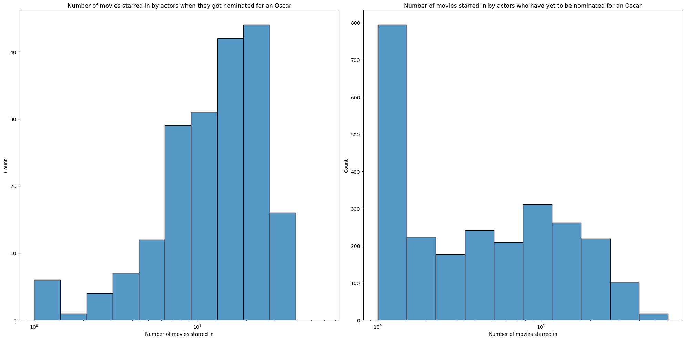
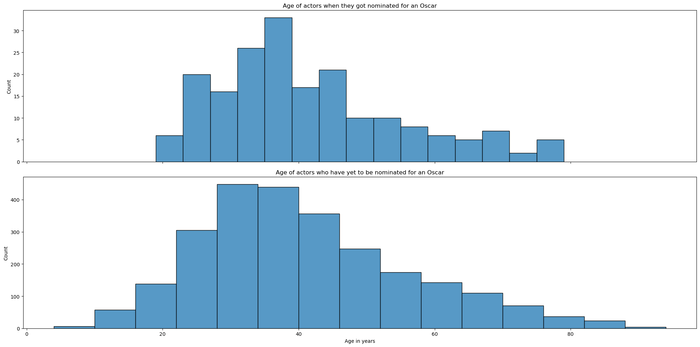
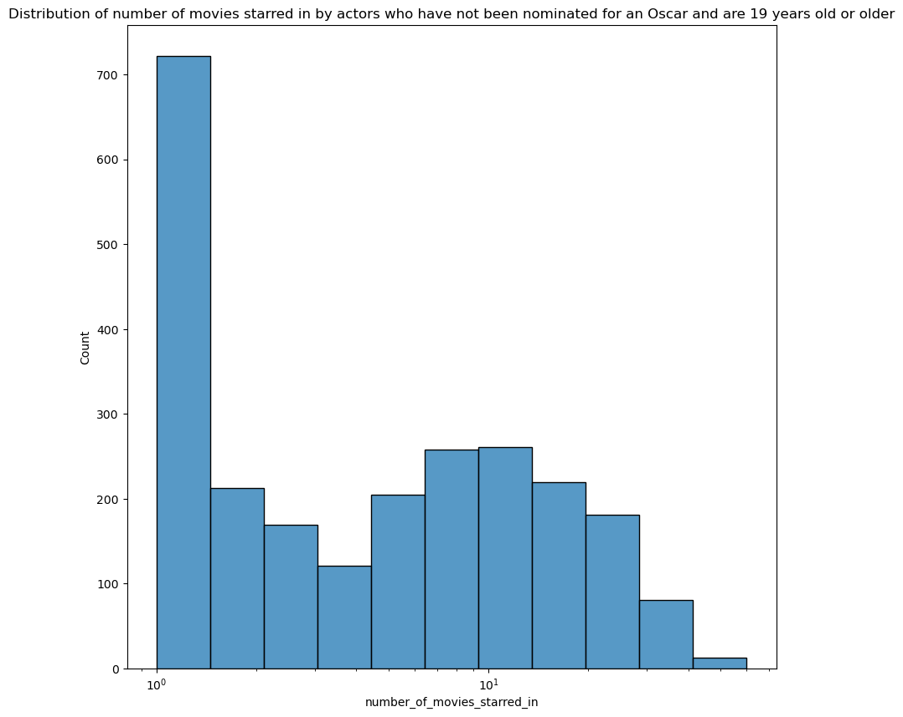

# Data preperation
For the following analysis we used the CMU dataset containing tables of movies and of characters. The movies and characters have a one-to-many 
relationship allowing us to connect them. Furthermore, the character table contains a column specifying the actor playing the character. This dataset is supplemented with IMDb dataset to find the ratings for the movies and an dataset containing Oscar nomination.

Further we introduce three augmented features: Number of movies starred in, average rating of previous movies, average box office revenue of previous movies.   

The Oscars are comprised of many different cateogries. However, in the coming analysis we are interested in the following three categories for both men and women: actor/actress, actor/actress in a leading role, actor/actress in a supporting role. 

# Actor career
In this section we are intersted in finding out more about what characterizes the career of Oscar nominated actors. Furthermore, we explore how an actor's career is impacted after being nominated for their first Oscar. 

For this analysis we split the career of an Actor into three parts: Before being nominated for their first Oscar, at the moment they were nominated for their first Oscar and the career after their first nomination. For actors who have never received or have yet to receive an Oscar nomination we observe their career as one phase. Moreover, for the first part we are only concerned about actors who have been active in the 21st centuary. The reason for this is that our dataset starts at 1928 and for the analysis to make sense we need to observe the actors from the start of their career. 

For our first analysis let's find out how many movies actors star in before being nominated for an Oscar and compare this to the number of movies starred in for actors who have never or yet to receive a nomination. 

Observing the plots it appears that when actors receive their first Oscar nomination when they have starred in more movies than what most actors have starred in over their career. The average number of movies starred in before receiving an Oscar nomination is 15.13 while in our dataset non-nominated actors have starred in an average of 7.67 movies over their entire career.

However, this analysis is a slightly flawed as the non-nominated sample could contain young actors who are just starting out and are thus weighing down the average. Let's furher analyse this potential flaw by plotting the age distribution in both samples.

The average age of the nominated group is 41.26 and 40.17 for the non-nominated group. However, observing the distribution we observe that the youngest nominated actor is 19 years old while the youngest actor in the non-nominated group is 4 years old. This could explain why the average number of movies starred is lower in the non-nominated group. Therefore, to improve our analysis we filter the non-nominated group to only contain actors who are 19 years old or older. This will give each actor in the sample the same oppurtunity to star in the same number of movies.

In the new sample the average number of movies starred in is 7.92. Let's further investigate if the difference in averages is significant. To do this we utilise and T-test and calculate a P-value of 1.27e-27. This P-value falls below the threshold and we thus reject the null hypothesis being that the averages between the samples would be the same and accept the alternative hypothesis that they are different.  

From this we make the conclusion that actors need to star in around 15 movies on average before being nominated for their first Oscar. In addition, we conclude that one of the reasons why some actors may not have been nominated for an Oscar is due to not having starred in enough movies yet or throught out their career.

With the conclusion that actors need to star in more movies in order to receive Oscar nominations we continue our analysis by analysing if the "success" of the movies you starred in prior to being nominated matters.

# T-test
A T-test is a statistical test used to determine if there is a significant difference between the means of two independent distribution. 
Firstly, the null hypothesis is stated which in the following section is that the means of the two samples and are identical and thus the alternative
hypothesis becomes that they are different. The T-statistic is calculated as a function of the two samples (INSERT EQUATION) and using a table it is possible
to find the probability of the samples having identical means, thus the null hypothesis being correct. The probability of the null hypothesis being true is known as
the P-value for the test. In this article we use a threshold of 5% for the P-value, meaning if the P-value is below 5% we reject the null hypothesis with 95% confidence
and accept the alternative hypothesis. 
